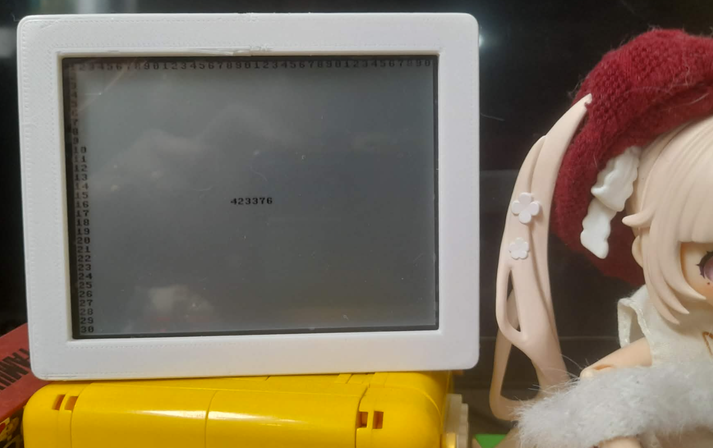
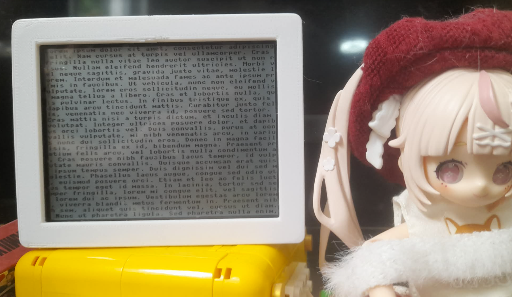

# MicroPython ST7305 RLCD Driver

MicroPython driver for ST7305 RLCD panel used in 4.2" displays.

This fork focuses specifically on the ST7305 4.2" 400×300 RLCD panel, with a fully working framebuffer implementation and optimized refresh path for ESP32-S3 class devices.

---

## 🚀 Features

- Framebuffer-based rendering using framebuf.FrameBuffer
- MONO (1-bit) display support
- Fast SPI refresh pipeline
- Viper-optimized _convert() routine
- Full 400×300 ST7305 support (tested on Waveshare 4.2")
- Minimal RAM usage after initialization

---

---

## 📺 Supported Configuration (This Fork)

This repository is intentionally focused on:

- ST7305 4.2" RLCD
- Resolution: 400 × 300 only

Other resolutions / ST7302 variants are not maintained here.

---

## ⚠️ Scope of this Fork

This fork has been simplified and refocused:

- Removed or excluded other ST7302/ST7305 variants
- No longer maintaining multiple panel resolutions
- Dedicated support for ST7305 400×300 only

If you need other drivers or panel variants, please refer to the original projects listed below.

---

## 🧪 Demo / Testing

A working demo.py is included in the original project and can be used to test basic functionality and SPI wiring before using this driver.

Run:

from demo import main
main()

---

## ⚡ Performance

On ESP32-class MCUs:

- refresh() (Viper): ~7–15 ms
- Bytecode fallback: ~100–150 ms

---

## 📌 Example Usage (ESP32 + ST7305 400×300)

import time, random
from machine import Pin, SPI
from st7305viper import RLCD42

spi = SPI(1, baudrate=500000, polarity=0, phase=0,
          sck=Pin(11), mosi=Pin(12))

cs = Pin(40, Pin.OUT, value=1)
dc = Pin(5, Pin.OUT, value=1)
rst = Pin(41, Pin.OUT, value=1)

lcd = RLCD42(spi, cs, dc, rst)
lcd.fill(0)

lcd.text("Hello RLCD 400x300", 10, 10, 1)
lcd.refresh()

---

## 🧠 Technical Notes

- Uses framebuf.MONO_VLSB
- Each byte represents 8 vertical pixels
- Internal conversion maps framebuffer → ST7305 bitstream format
- CAS / RAS windowing configured for full 400×300 addressing
- Gate line setting adjusted for full panel utilization

---

## 🙏 Credits

- https://github.com/elulis/micropython_ST7302
- https://github.com/zhcong/ST7302-for-micropython

Special thanks to both authors.

---

## 🧩 Notes

This fork focuses only on ST7305 400×300 RLCD support.
